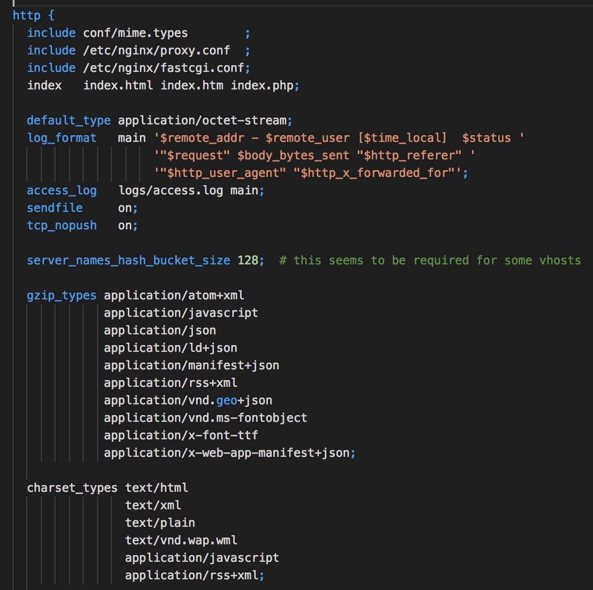
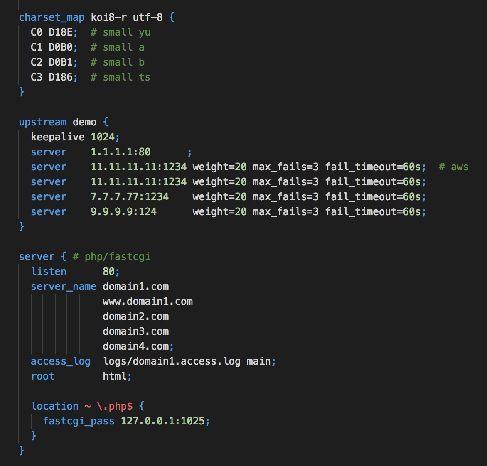
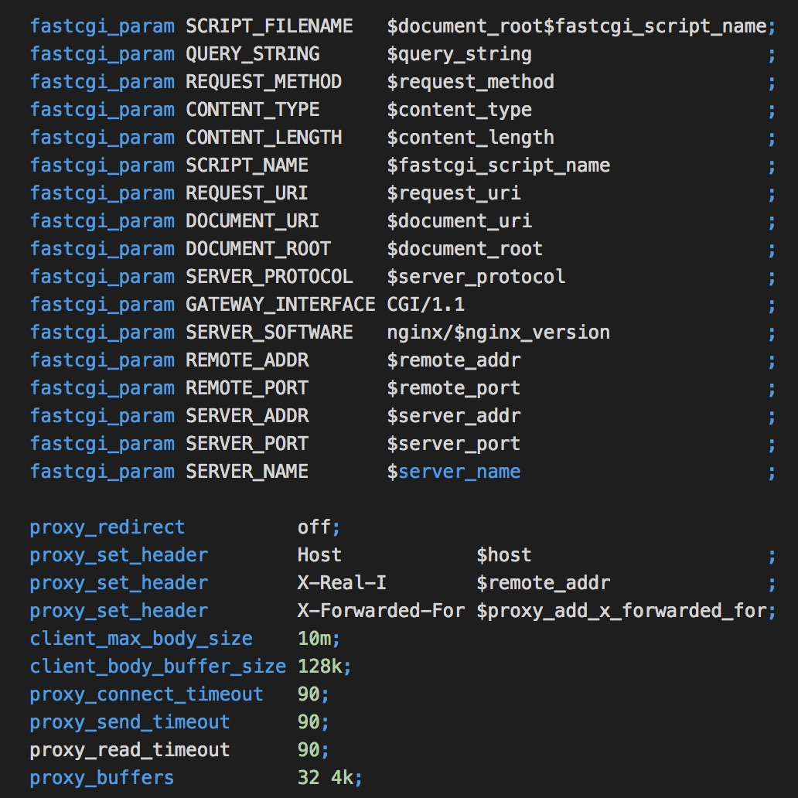

# Ngxfmt

```
usage: ngxfmt [-h] [-f nginx.conf] [-d conf.d]

nginx conf fmt tool

optional arguments:
  -h, --help     show this help message and exit
  -f nginx.conf  conf file
  -d conf.d      conf directory
```

DEMO:






